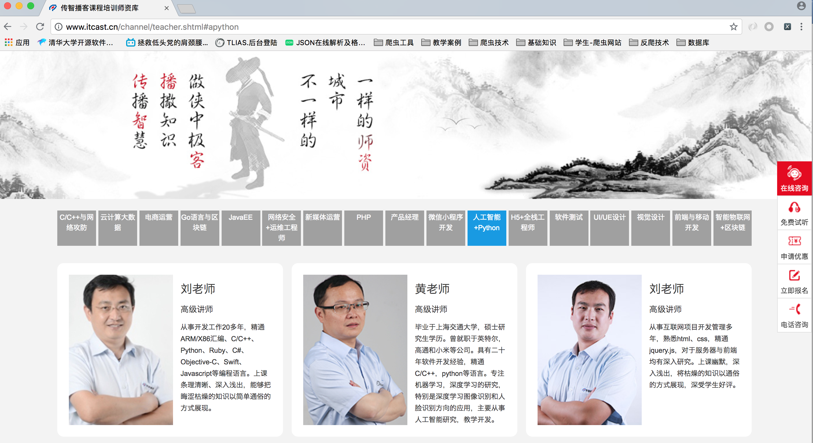

## 2. 明确抓取目标

第二步就是明确爬虫项目要抓取的内容。我们使用传智播客的讲师介绍页面做为示例，该页面的网址如下： 

[http://www.itcast.cn/channel/teacher.shtml#apython](http://www.itcast.cn/channel/teacher.shtml#apython)，页面内容如下图所示 ,mySpider项目的抓取内容就是该页面中所有讲师的姓名、级别和个人信息等数据，这就明确了该项目的抓取目标。
> 讲师介绍页面



## 定义Item类,来明确要提取数据

Scrapy使用Item（实体）来表示要爬取的数据。Item定义结构化数据字段，有点像Python中的字典dict，但是提供了一些额外的保护以减少错误。

##### 2.1 为什么要定义Item

1. 定义item即提前规划好哪些字段需要抓取，scrapy.Field()仅仅是提前占坑，通过item.py能够让别人清楚自己的爬虫是在抓取什么，同时定义好哪些字段是需要抓取的，没有定义的字段不能使用，防止手误

2. 在python大多数框架中，大多数框架都会自定义自己的数据类型(在python自带的数据结构基础上进行封装)，目的是增加功能，增加自定义异常

#### 2.2 定义Item
Scrapy框架提供了基类scrapy.Item用来表示实体数据。我们一般需要创建一个继承自scrapy.Item的子类，并为该子类添加类型为scrapy.Field类型的属性来表示爬虫项目的实体数据（可以理解成类似于ORM的映射关系）。

在PyCharm中打开mySpider目录下的items.py文件，可以看到Scrapy框架已经在items.py文件中自动生成了继承自scrapy.Item的MyspiderItem类。我们只需要修改MyspiderItem类的定义，为它添加属性即可。代码如下。

```py
import scrapy
class MyspiderItem(scrapy.Item):
    # 姓名
    name = scrapy.Field()
    # 等级
    level = scrapy.Field()
    # 简介
    info = scrapy.Field()
```

在上述代码中，为MyspiderItem类添加了3个属性：name、title、和info，分别用于表示讲师的姓名、级别、和个人信息。


